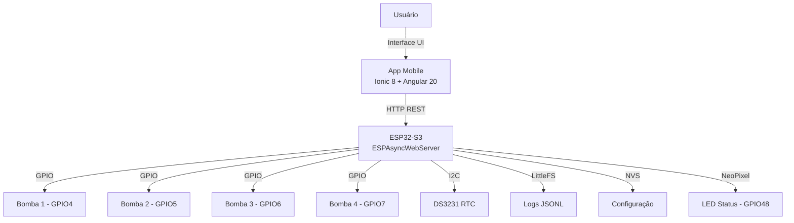

# AquaBalancePro

Sistema de automação de dosagem para aquários marinhos (Reef). Composto por um **aplicativo mobile** para controle/monitoramento e um **firmware embarcado** em ESP32-S3 que comanda bombas peristálticas.

## Arquitetura



| Componente | Tecnologia | Função |
|---|---|---|
| **App Mobile** | Ionic 8 + Angular 20 + Tailwind CSS + Capacitor 8 | Interface do usuário, configuração, monitoramento |
| **Firmware** | PlatformIO / Arduino Framework (ESP32-S3) | Controle das bombas, servidor REST, scheduler |
| **RTC** | DS3231 (I2C) | Relógio de tempo real para agendamentos offline |
| **Bombas** | 4 peristálticas (GPIO 4, 5, 6, 7) | Dosagem por tempo (aberto até `dosagem × 700ms × calibrCoef`) |
| **Comunicação** | HTTP REST (JSON) via Wi-Fi AP | App se conecta ao AP do ESP32 (`192.168.4.1`) |

## Repositório

```
/
├── src/                    # Código-fonte do app Ionic/Angular
│   ├── app/
│   │   ├── home/           # Dashboard principal
│   │   ├── configuracao/   # Config de bombas e schedules
│   │   ├── calibracao/     # Calibração e teste manual
│   │   ├── logs/           # Histórico de dosagens
│   │   ├── analytics/      # Gráficos de timeline
│   │   └── services/       # DoserService + WifiBindingService
│   ├── theme/              # Variáveis CSS (dark mode ocean)
│   └── types/              # Declarações de tipos
├── esp32/                  # Firmware do ESP32
│   └── src/main.cpp        # Código único (1360 linhas)
├── android/                # Projeto Android nativo (Capacitor)
├── ios/                    # Projeto iOS nativo (Capacitor)
├── docs/                   # Documentação
└── assets/                 # Imagens e logos
```

## API REST (ESP32 → App)

O ESP32 expõe um servidor HTTP na porta `80` no IP `192.168.4.1`. O app se comunia exclusivamente por esta API.

| Método | Endpoint | Descrição |
|---|---|---|
| `GET` | `/ping` | Health check |
| `GET` | `/status` | Status do dispositivo (hora, Wi-Fi, AP) |
| `GET` | `/config` | Configuração atual das 4 bombas |
| `POST` | `/config` | Atualizar configuração das bombas |
| `POST` | `/time` | Sincronizar RTC com o celular |
| `POST` | `/dose` | Dosagem manual imediata |
| `GET` | `/logs` | Histórico de dosagens |
| `DELETE` | `/logs` | Limpar histórico |

## Fluxo de Uso

1. **Conectar** — Celular conecta ao Wi-Fi `AquaBalancePro` (AP do ESP32)
2. **Status** — HomePage exibe status em tempo real (polling a cada 15s)
3. **Configurar** — Sincroniza hora, nomeia bombas, define schedules (3 por bomba)
4. **Calibrar** — Envia dose de teste, informa volume real, recalibra coeficiente
5. **Monitorar** — Logs e gráficos de dosagem programada vs executada

## Primeiros Passos

### App (Ionic)
```bash
npm install
ionic serve          # Desenvolvimento web
ionic build          # Build de produção
npx cap sync android # Sincronizar com projeto nativo
```

### Firmware (ESP32)
```bash
cd esp32
platformio run --target upload   # Compilar e enviar via USB
platformio device monitor        # Serial monitor (115200 baud)
```

### Hardware (ESP32-S3)

| GPIO | Conexão |
|---|---|
| 4 | Bomba 1 |
| 5 | Bomba 2 |
| 6 | Bomba 3 |
| 7 | Bomba 4 |
| 21 (SDA) | DS3231 RTC |
| 20 (SCL) | DS3231 RTC |
| 48 | NeoPixel WS2812B |

## Documentação Detalhada

- [Arquitetura do Sistema](docs/arquitetura.md)
- [App Mobile (Ionic/Angular)](docs/ionic-app.md)
- [Firmware ESP32](docs/esp32-firmware.md)
- [Robustez Offline](esp32/ROBUSTEZ_OFFLINE.md)

## Stack

| Categoria | Tecnologia |
|---|---|
| **Frontend** | Ionic 8, Angular 20, Tailwind CSS v4, Chart.js |
| **Mobile** | Capacitor 8 (Android + iOS) |
| **Firmware** | PlatformIO, Arduino Framework, ESP32-S3 |
| **Bibliotecas** | ESPAsyncWebServer, RTClib, ArduinoJson 7, Adafruit NeoPixel |
| **Persistência** | LittleFS (logs), NVS Preferences (config) |
| **Testes** | Jasmine 5 + Karma 6 |
